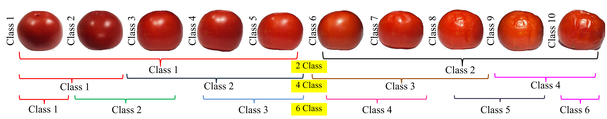

### Publication
Das S., Kar S., Sekh A.A. (2021) FGrade: A Large Volume Dataset for Grading Tomato Freshness Quality. 
In: Singh S.K., Roy P., Raman B., Nagabhushan P. (eds) Computer Vision and Image Processing. CVIP 2020. 
Communications in Computer and Information Science, vol 1377. Springer, Singapore.

[Link to The Paper](https://doi.org/10.1007/978-981-16-1092-9_38)

### Dataset Description
Here, annotation referred to grouping tomato by its freshness. We have 6,470 number of images of tomatoes and they are grouped in 10 classes. 
Class 1 contains most fresh items and last class contains the images of fully rotten tomatoes. As per our collected data it was noticed that 
all the samples were not rotten on the same day. They have a different life of span of freshness as they were not collected on the same day by the 
farmer from the garden. 10 volunteers were involved in the annotation process. Volunteers are shown one by one samples with the labeled number of days 
past from the beginning of storage. Next, they need to grade the tomatoes from 1 to 10, where 1 is most fresh and 10 is rotten. The volunteers grouped them by visually inspecting and considering the days spent during storage. Finally, the sample is assigned into a class by maximum voting from the volunteers. Once the initial assignment of class 1 to 10 is achieved, the dataset is used to create 2, 4, and 6 class problems by merging near by classes.

### License

Copyright © 2021 Sk. Arif Ahmed

The content of this repository is bound by the following licenses:

- The documents and data are licensed under the MIT license.
